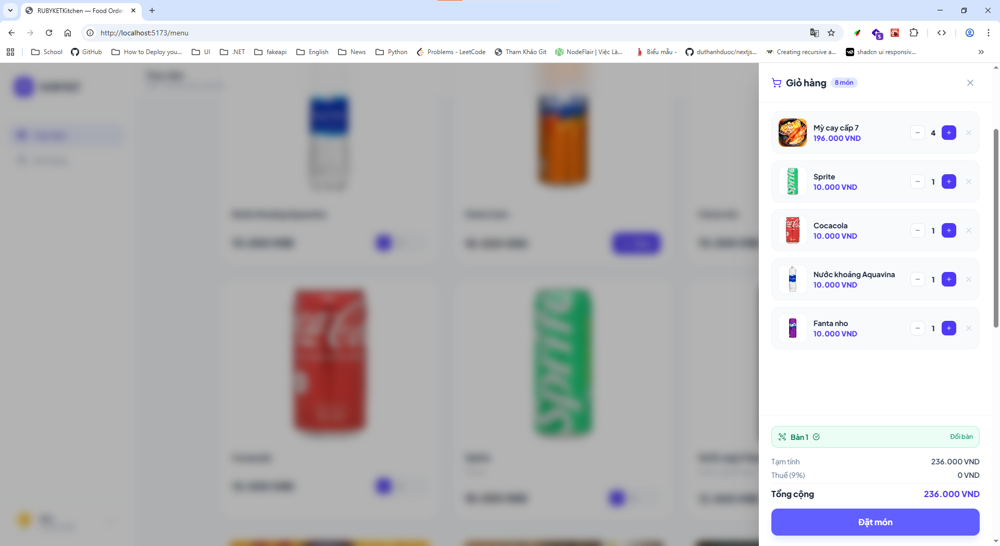
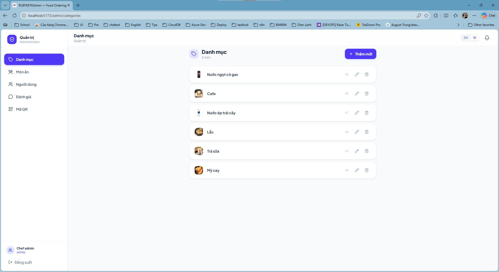
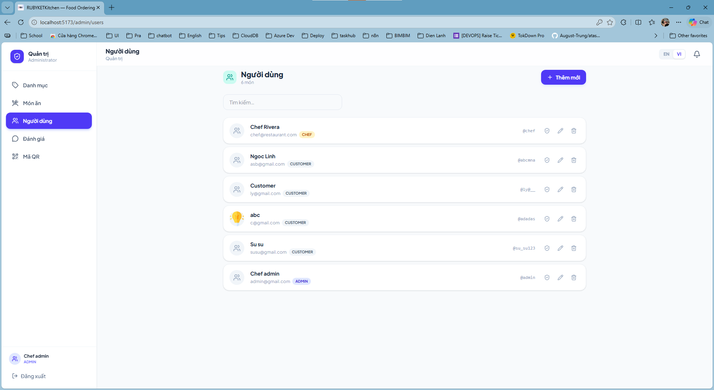

# 🍽️ Ordering Food Management System

Hệ thống quản lý đặt hàng và điều hành nhà hàng toàn diện, được xây dựng bằng **React + TypeScript + Vite** (Frontend) và **Node.js + Express + Prisma** (Backend), hỗ trợ 4 roles chính với các tính năng riêng biệt.

---

## 📋 Tổng Quan Dự Án

Dự án cung cấp một nền tảng hoàn chỉnh để quản lý hoạt động nhà hàng:

- **Khách hàng**: Xem thực đơn, đặt món, theo dõi đơn hàng realtime
- **Nhân viên phục vụ**: Xác nhận giao hàng, quản lý thanh toán
- **Đầu bếp**: Theo dõi phiếu yêu cầu, cập nhật tiến độ nấu
- **Quản trị viên**: Quản lý menu, hạng mục, người dùng, vai trò

---

## 🎯 4 Interfaces Chính

### 1. **👨‍💼 Customer - Giao diện khách hàng**

Khách hàng có thể duyệt thực đơn, thêm món vào giỏ, đặt hàng và theo dõi đơn hàng theo thời gian thực.

#### Xem Thực Đơn


_Khách hàng duyệt thực đơn theo danh mục và tìm kiếm_

#### Giỏ Hàng & Đặt Món


_Quản lý giỏ hàng, nhập số bàn và đặt đơn_

#### Theo Dõi Đơn Hàng


_Theo dõi tiến độ đơn hàng realtime từ lúc tiếp nhận đến giao hàng_

---

### 2. **👨‍🍳 Chef - Giao diện đầu bếp**

Đầu bếp có thể xem các phiếu yêu cầu, quản lý thứ tự nấu ăn và cập nhật trạng thái đơn hàng.

#### Bảng Điều Khiển Bếp


_Danh sách các phiếu nấu ăn, sắp xếp theo ưu tiên và thời gian_

**Tính năng:**

- ✅ Xem các đơn hàng đang chờ xử lý
- ✅ Cập nhật trạng thái (Nhận đơn → Chuẩn bị → Nấu → Sẵn sàng)
- ✅ Hiển thị thông tin chi tiết món ăn
- ✅ Theo dõi thời gian chờ

---

### 3. **🚚 Employee - Giao diện nhân viên phục vụ**

Nhân viên phục vụ quản lý giao hàng, thu tiền và cập nhật trạng thái thanh toán.

#### Trạm Giao Hàng


_Danh sách các đơn sẵn sàng giao và quản lý thanh toán_

**Tính năng:**

- ✅ Xem danh sách các đơn sẵn sàng
- ✅ Xác nhận giao hàng cho khách
- ✅ Thu tiền và quản lý phương thức thanh toán
- ✅ Theo dõi đơn chưa thanh toán

---

### 4. **⚙️ Admin - Giao diện quản trị**

Quản trị viên có toàn quyền quản lý hệ thống: quản lý menu, hạng mục, người dùng và phân quyền.

#### Quản Lý Danh Mục


_Tạo, chỉnh sửa, xóa các danh mục menu_

#### Quản Lý Món Ăn


_Quản lý toàn bộ menu: thêm/sửa/xóa món, tải ảnh, cập nhật giá_


_Quản lý mã QR các bàn_

#### Quản Lý Người Dùng & Vai Trò


_Quản lý tài khoản nhân viên, phân công vai trò (Admin/Chef/Employee)_

**Tính năng:**

- ✅ CRUD danh mục sản phẩm
- ✅ CRUD món ăn (tên, giá, ảnh, mô tả, tag)
- ✅ Quản lý ảnh sản phẩm (tải lên, xóa, đặt ảnh chính)
- ✅ CRUD người dùng
- ✅ Gán/xóa vai trò cho người dùng
- ✅ Kích hoạt/vô hiệu hóa tài khoản

---

## 🛠️ Công Nghệ Sử Dụng

### **Frontend**

- ⚛️ **React 18** + **TypeScript**
- ⚡ **Vite** - Build tool hiệu suất cao
- 🎨 **Tailwind CSS** - Styling responsive
- 🎬 **Framer Motion** - Animations
- 🌐 **React Router v7** - Navigation
- 🌍 **Multi-language** - Hỗ trợ Tiếng Việt & English

### **Backend**

- 🟢 **Node.js** + **Express.js**
- 🗄️ **Prisma ORM** - Database management
- 🐘 **PostgreSQL** (Supabase)
- 🔐 **JWT Authentication** - Xác thực an toàn
- 📚 **Swagger/OpenAPI** - API documentation
- ✅ **Zod** - Schema validation

---

## 🚀 Bắt Đầu

### **Cài Đặt Dependencies**

```bash
# Backend
cd backend
pnpm install

# Frontend
cd frontend
pnpm install
```

### **Cấu Hình Database**

```bash
# Di chuyển vào backend
cd backend

# Tạo migration từ schema
pnpm prisma migrate dev --name init

# Generate Prisma Client
pnpm prisma generate
```

### **Chạy Ứng Dụng**

```bash
# Terminal 1: Backend (http://localhost:3001)
cd backend
pnpm run dev

# Terminal 2: Frontend (http://localhost:5173)
cd frontend
pnpm run dev
```

---

## 📱 Luồng Sử Dụng

### **Customer Workflow**

1. 🔐 Đăng nhập/Đăng ký
2. 📖 Duyệt thực đơn
3. 🛒 Thêm món vào giỏ
4. 📝 Nhập số bàn và đặt đơn
5. 👀 Theo dõi tiến độ nấu (realtime)
6. 🎉 Nhận món ăn

### **Chef Workflow**

1. 📋 Xem phiếu yêu cầu mới
2. ✍️ Cập nhật: Nhận đơn → Chuẩn bị → Nấu → Sẵn sàng
3. 👀 Khách hàng thấy cập nhật realtime

### **Employee Workflow**

1. 📦 Xem danh sách đơn sẵn sàng
2. ✓ Giao hàng cho khách
3. 💰 Thu tiền + chọn phương thức thanh toán
4. ✅ Xác nhận thanh toán

### **Admin Workflow**

1. ⚙️ Quản lý danh mục & menu
2. 👥 Quản lý tài khoản nhân viên
3. 🔑 Phân quyền vai trò
4. 📊 Giám sát hoạt động hệ thống

---

## 📂 Cấu Trúc Thư Mục

```
ordering_food/
├── backend/
│   ├── src/
│   │   ├── controllers/        # API route handlers
│   │   ├── services/           # Business logic
│   │   ├── providers/          # Data access layer (Prisma)
│   │   ├── middleware/         # Auth, RBAC
│   │   ├── schemas/            # Zod validation
│   │   └── utils/              # Helpers
│   ├── prisma/
│   │   └── schema.prisma       # Database schema
│   └── src/server.ts           # Main app file
│
├── frontend/
│   ├── src/
│   │   ├── pages/              # Page components
│   │   ├── layouts/            # Layout wrappers (Admin/Staff/Customer)
│   │   ├── components/         # Reusable components
│   │   ├── context/            # Auth & Lang contexts
│   │   ├── hooks/              # Custom hooks
│   │   ├── services/           # API client
│   │   ├── types.ts            # TypeScript types
│   │   └── router/             # React Router config
│   └── public/                 # Static assets & screenshots
│
└── README.md                   # This file
```

---

## 🔐 Xác Thực & Phân Quyền

### **Roles & Permissions**

| Role         | Permissions                                      |
| ------------ | ------------------------------------------------ |
| **Customer** | Xem menu, đặt hàng, theo dõi                     |
| **Chef**     | Xem phiếu, cập nhật trạng thái                   |
| **Employee** | Xác nhận giao hàng, quản lý thanh toán           |
| **Admin**    | Quản lý tất cả (CRUD danh mục, menu, người dùng) |

### **Authentication**

- JWT Token lưu trong `localStorage`
- Auto-refresh token khi hết hạn
- Redirect login khi không xác thực

---

## 🌟 Tính Năng Chính

✅ **Real-time Updates** - SSE (Server-Sent Events) cho trạng thái đơn hàng  
✅ **Multi-language** - Tiếng Việt & English  
✅ **Responsive Design** - Mobile-first UI  
✅ **Image Upload** - Tải ảnh menu với xử lý tối ưu  
✅ **Search & Filter** - Tìm kiếm món ăn theo tên/danh mục  
✅ **Role-based Access** - Kiểm soát quyền truy cập  
✅ **Payment Methods** - Hỗ trợ nhiều hình thức thanh toán

---

## 📝 API Documentation

Swagger API docs available at: `http://localhost:3001/api/docs`

Main endpoints:

- `POST /api/v1/auth/login` - Đăng nhập
- `POST /api/v1/auth/register` - Đăng ký
- `GET /api/v1/menuItems` - Lấy menu
- `POST /api/v1/orders` - Tạo đơn
- `GET /api/v1/orders/{id}` - Chi tiết đơn
- Admin routes: `/api/v1/categories`, `/api/v1/users`, `/api/v1/roles`

---

## 🤝 Đóng Góp

Để đóng góp:

1. Fork dự án
2. Tạo branch tính năng (`git checkout -b feature/YourFeature`)
3. Commit thay đổi (`git commit -m 'Add YourFeature'`)
4. Push lên branch (`git push origin feature/YourFeature`)
5. Mở Pull Request

---

## 📄 License

MIT License - Xem file LICENSE để chi tiết

---

## 📞 Liên Hệ

Nếu có câu hỏi hoặc kiến nghị, vui lòng mở issue hoặc liên hệ qua email.

---

**Cảm ơn bạn đã sử dụng Ordering Food Management System!** 🎉
