# 🍽️ Ordering Food Management System

A comprehensive restaurant management and ordering platform built with **Next.js + TypeScript** (Client) and **Node.js + Express + Prisma** (Backend), supporting 4 main roles with dedicated features.

---

## 📋 Project Overview

The project provides a complete platform for managing restaurant operations:

- **Customers**: Browse menu, place orders, track orders in real-time
- **Waitstaff**: Confirm deliveries, manage payments
- **Chefs**: Track order tickets, update cooking progress
- **Administrators**: Manage menu, categories, users, roles

---

## 🎯 4 Main Interfaces

### 1. **👨‍💼 Customer - Customer Interface**

Customers can browse the menu, add dishes to cart, place orders, and track their order status in real-time.

#### Browse Menu

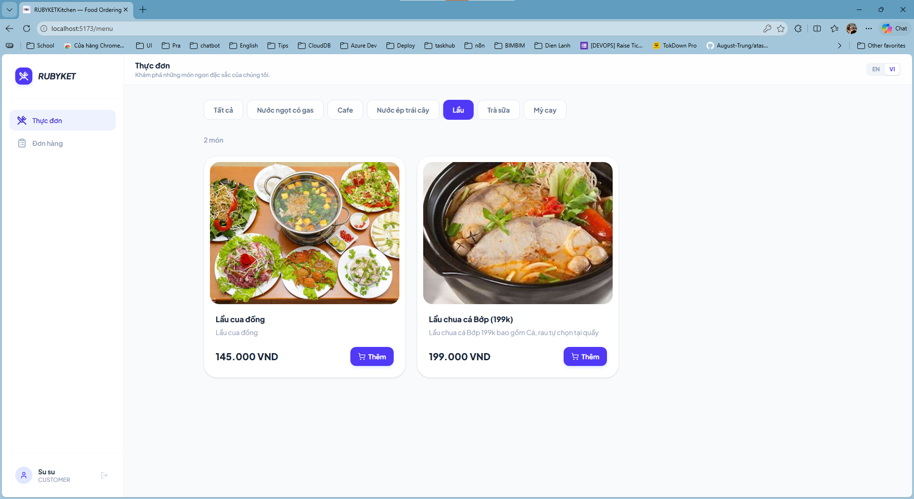
_Customers browse the menu by category and search_

#### Shopping Cart & Place Order

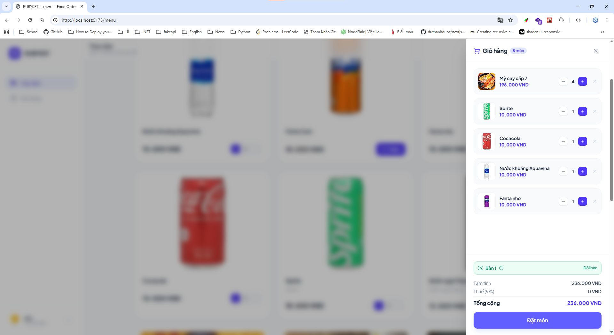
_Manage shopping cart, enter table number, and place order_

#### Track Order Status

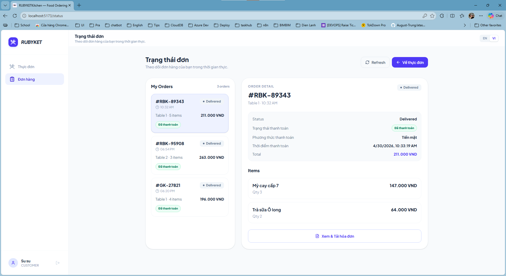
_Track order progress in real-time from order received to delivery_

---

### 2. **👨‍🍳 Chef - Chef Dashboard**

Chefs can view order tickets, manage cooking order, and update order status.

#### Chef Dashboard

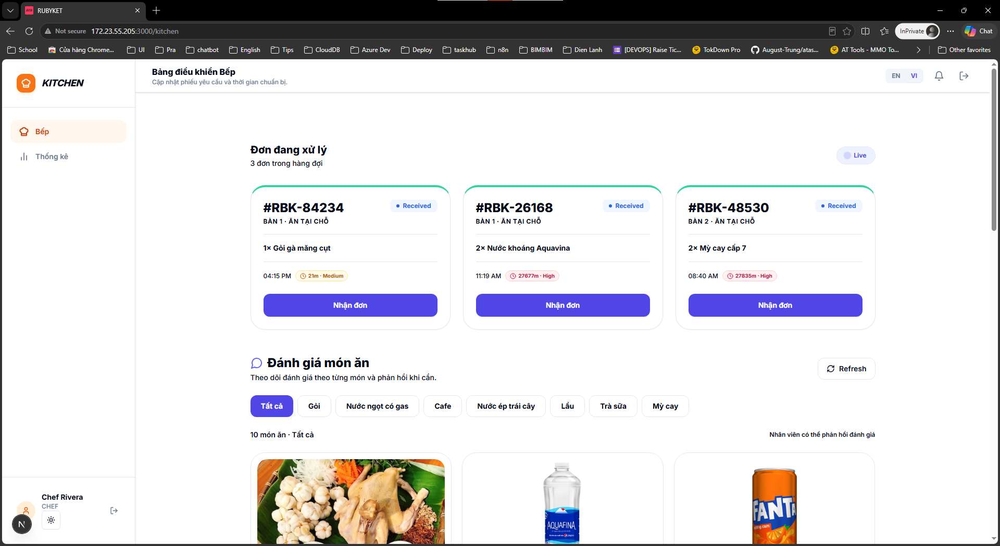
_List of cooking tickets, sorted by priority and time_

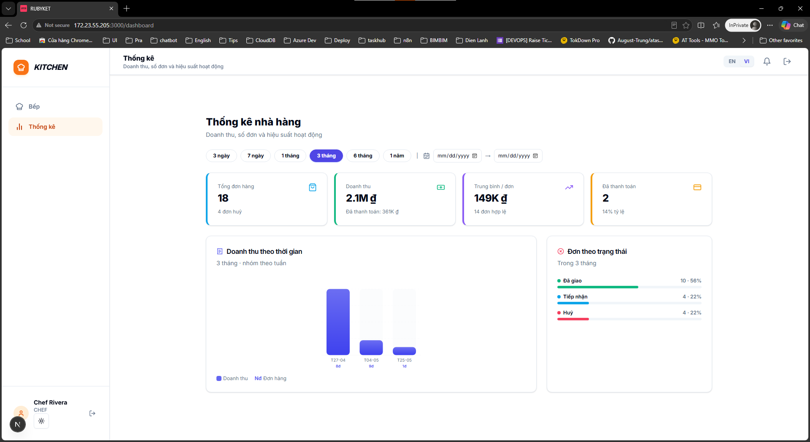
_Order chart, sorted by priority and time_

**Features:**

- ✅ View pending orders
- ✅ Update status (Order Received → Preparing → Cooking → Ready)
- ✅ Display detailed dish information
- ✅ Track wait time

---

### 3. **🚚 Employee - Waitstaff Interface**

Waitstaff manage order delivery, collect payments, and update payment status.

#### Delivery Station

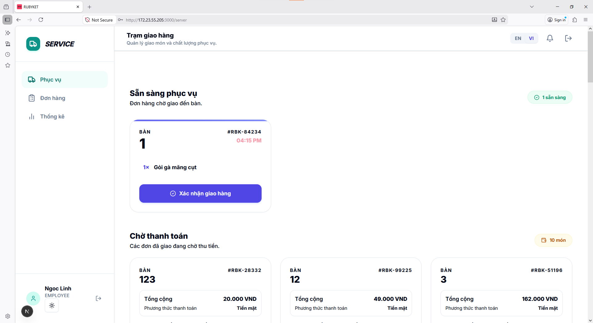
_List of ready-to-serve orders and payment management_

**Features:**

- ✅ View list of ready orders
- ✅ Confirm delivery to customers
- ✅ Collect payment and manage payment methods
- ✅ Track unpaid orders

---

### 4. **⚙️ Admin - Administration Interface**

Administrators have full control to manage the system: menu, categories, users, and permissions.

#### Manage Categories

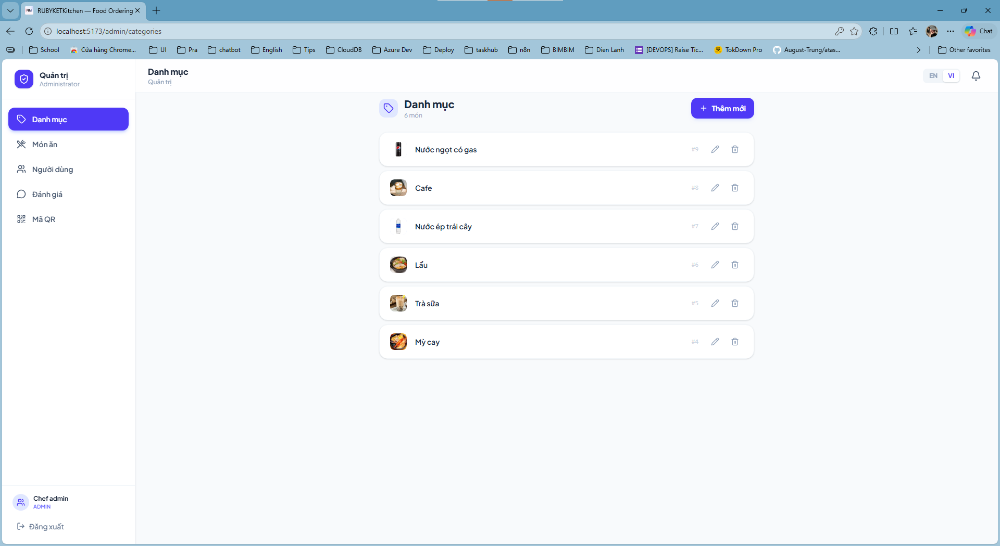
_Create, edit, delete menu categories_

#### Manage Menu Items

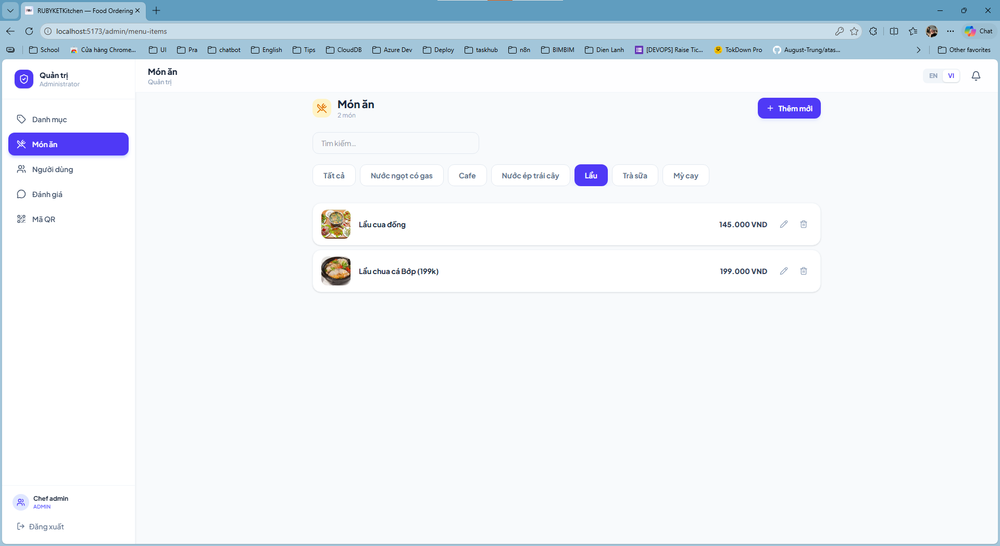
_Manage all menu items: add/edit/delete dishes, upload images, update prices_

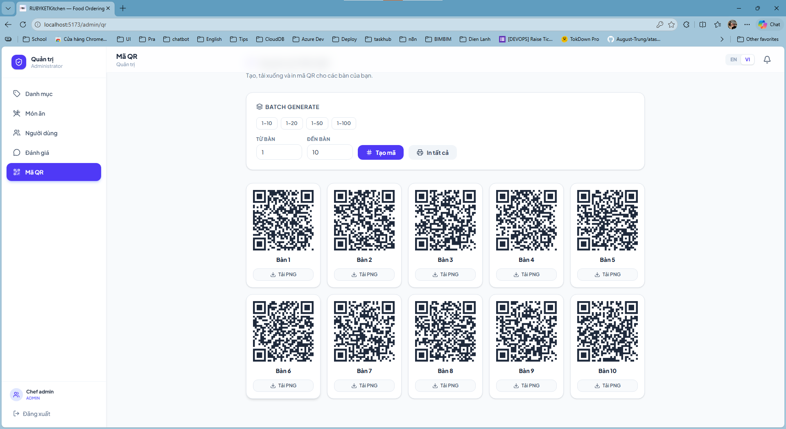
_Manage QR table codes_

#### Manage Users & Roles

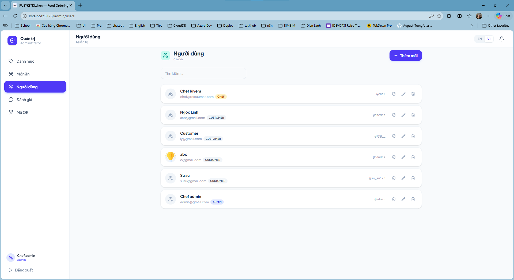
_Manage employee accounts, assign roles (Admin/Chef/Employee)_

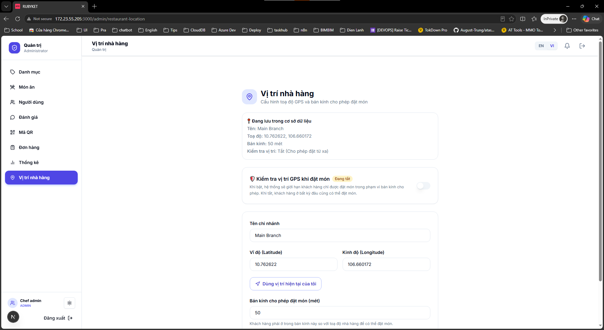
_ Restaurant location Management (Admin)_

**Features:**

- ✅ CRUD product categories
- ✅ CRUD menu items (name, price, images, description, tags)
- ✅ Manage product images (upload, delete, set primary)
- ✅ CRUD users
- ✅ Assign/remove roles from users
- ✅ Enable/disable accounts
- ✅ Configure restaurant GPS coordinates and geofence radius
- ✅ Toggle geofencing checks on/off instantly

---

## 🛠️ Technology Stack

### **Client**

- ⚛️ **Next.js 16** + **React 19** + **TypeScript**
- ⚡ **App Router** - File-based routing in Next.js
- 🎨 **Tailwind CSS** - Responsive styling
- 🎬 **Framer Motion** - Animations
- 🌙 **next-themes** - Light/dark theme support
- 🌍 **Multi-language** - Vietnamese & English support

### **Backend**

- 🟢 **Node.js** + **Express.js**
- 🗄️ **Prisma ORM** - Database management
- 🐘 **PostgreSQL** (Supabase)
- 🔐 **JWT Authentication** - Secure authentication
- 📚 **Swagger/OpenAPI** - API documentation
- ✅ **Zod** - Schema validation

---

## 📱 User Workflows

### **Customer Workflow**

1. 🔐 Login/Register
2. 📖 Browse menu
3. 🛒 Add items to cart
4. 📝 Enter table number and place order
5. 👀 Track cooking progress (real-time)
6. 🎉 Receive order

### **Chef Workflow**

1. 📋 View new order tickets
2. ✍️ Update status: Order Received → Preparing → Cooking → Ready
3. 👀 Customers see real-time updates

### **Waitstaff Workflow**

1. 📦 View list of ready orders
2. ✓ Deliver to customer
3. 💰 Collect payment + select payment method
4. ✅ Confirm payment

### **Admin Workflow**

1. ⚙️ Manage categories & menu
2. 👥 Manage employee accounts
3. 🔑 Assign roles & permissions
4. 📊 Monitor system activity

---

## 📂 Project Structure

```
ordering_food/
├── backend/
│   ├── src/
│   │   ├── controllers/        # API route handlers
│   │   ├── services/           # Business logic
│   │   ├── providers/          # Data access layer (Prisma)
│   │   ├── middleware/         # Auth, RBAC
│   │   ├── schemas/            # Zod validation
│   │   └── utils/              # Helpers
│   ├── prisma/
│   │   └── schema.prisma       # Database schema
│   └── src/server.ts           # Main app file
│
├── client/
│   ├── src/
│   │   ├── app/                # Next.js App Router routes
│   │   ├── components/         # Reusable components
│   │   ├── contexts/           # Auth & Lang contexts
│   │   ├── hooks/              # Custom hooks
│   │   ├── lib/                # Shared utilities
│   │   ├── apiRequests/        # API client
│   │   └── schemaValidations/  # Client-side validation schemas
│   └── public/                 # Static assets & screenshots
│
└── README.md                   # This file
```

---

## 🔐 Authentication & Authorization

### **Roles & Permissions**

| Role         | Permissions                                      |
| ------------ | ------------------------------------------------ |
| **Customer** | Browse menu, place orders, track status          |
| **Chef**     | View tickets, update cooking status              |
| **Employee** | Confirm delivery, manage payments                |
| **Admin**    | Manage everything (CRUD categories, menu, users) |

### **Authentication**

- JWT Token stored in `localStorage`
- Auto-refresh token on expiry
- Redirect to login when unauthenticated

---

## 🌟 Key Features

✅ **Real-time Updates** - SSE (Server-Sent Events) for order status  
✅ **Multi-language** - Vietnamese & English  
✅ **Responsive Design** - Mobile-first UI  
✅ **Image Upload** - Upload menu images with optimization  
✅ **Search & Filter** - Search dishes by name/category  
✅ **Role-based Access** - Permission control  
✅ **Payment Methods** - Support multiple payment options  
✅ **GPS Geofencing** - Configurable GPS coordinates and radius limitation for order placement, with real-time toggle controls for administrators.

---

## 📝 API Documentation

Swagger API docs available at: `http://localhost:3001/api/docs`

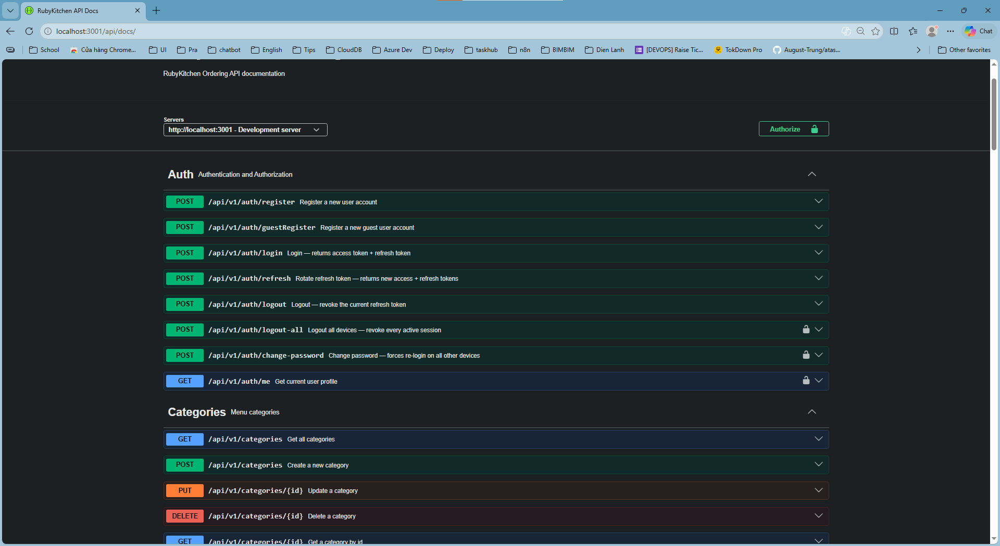
